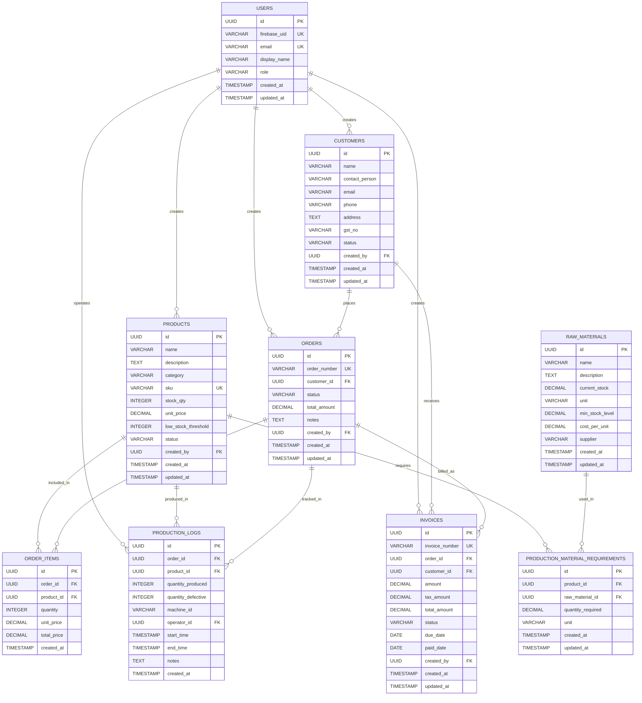

# Saft ERP - Entity Relationship Diagram

## Database Schema Overview

The Saft ERP system uses a PostgreSQL database with the following core entities and relationships:

## Visual ER Diagram

## Entity Descriptions

### 1. USERS
- **Purpose**: User authentication and authorization using Firebase
- **Key Fields**: 
  - `firebase_uid`: Links to Firebase authentication
  - `role`: User role (admin, sales, production_manager, user)
- **Relationships**: Creates customers, products, orders, invoices; operates production logs

### 2. CUSTOMERS
- **Purpose**: Customer information management
- **Key Fields**:
  - `gst_no`: GST registration number for Indian businesses
  - `status`: Customer status (active/inactive)
- **Relationships**: Places orders; receives invoices

### 3. PRODUCTS
- **Purpose**: Product catalog and inventory management
- **Key Fields**:
  - `sku`: Stock Keeping Unit (unique identifier)
  - `stock_qty`: Current inventory quantity
  - `low_stock_threshold`: Reorder point
- **Relationships**: Included in order items; produced in production logs; requires raw materials

### 4. RAW_MATERIALS
- **Purpose**: Raw material inventory management
- **Key Fields**:
  - `current_stock`: Available quantity
  - `min_stock_level`: Minimum stock threshold
  - `cost_per_unit`: Cost per unit for calculations
- **Relationships**: Used in production material requirements

### 5. ORDERS
- **Purpose**: Order management and tracking
- **Key Fields**:
  - `order_number`: Unique order identifier
  - `status`: Order status (pending, processing, completed, etc.)
  - `total_amount`: Total order value
- **Relationships**: Contains order items; tracked in production logs; billed as invoices

### 6. ORDER_ITEMS
- **Purpose**: Individual items within orders
- **Key Fields**:
  - `quantity`: Quantity ordered
  - `unit_price`: Price per unit at time of order
  - `total_price`: Line item total
- **Relationships**: Links orders to products

### 7. PRODUCTION_LOGS
- **Purpose**: Manufacturing process tracking
- **Key Fields**:
  - `quantity_produced`: Good units produced
  - `quantity_defective`: Defective units
  - `machine_id`: Production machine identifier
- **Relationships**: Tracks order production; links to products and operators

### 8. PRODUCTION_MATERIAL_REQUIREMENTS
- **Purpose**: Bill of Materials (BOM) - defines raw materials needed per product
- **Key Fields**:
  - `quantity_required`: Amount of raw material needed
  - `unit`: Unit of measurement
- **Relationships**: Links products to required raw materials

### 9. INVOICES
- **Purpose**: Billing and payment tracking
- **Key Fields**:
  - `invoice_number`: Unique invoice identifier
  - `status`: Payment status (pending, paid, overdue)
  - `due_date`: Payment due date
- **Relationships**: Bills orders; links to customers

## Key Business Rules

1. **Order Flow**: Customer → Order → Order Items → Production Logs → Invoice
2. **Inventory Management**: Products have stock quantities and low stock thresholds
3. **Production Planning**: Products require specific raw materials (BOM)
4. **User Roles**: Different user roles have different permissions
5. **Audit Trail**: All entities track creation and update timestamps

## Database Constraints

- **Foreign Keys**: Maintain referential integrity
- **Unique Constraints**: Order numbers, invoice numbers, SKUs, Firebase UIDs
- **Default Values**: Timestamps, status fields, numeric defaults
- **Cascade Deletes**: Order items deleted when order is deleted

## Technology Stack

- **Database**: PostgreSQL (via Supabase)
- **Authentication**: Firebase Auth
- **Backend**: Node.js/Express
- **Frontend**: React with Vite
- **ORM**: Direct SQL queries with connection pooling

