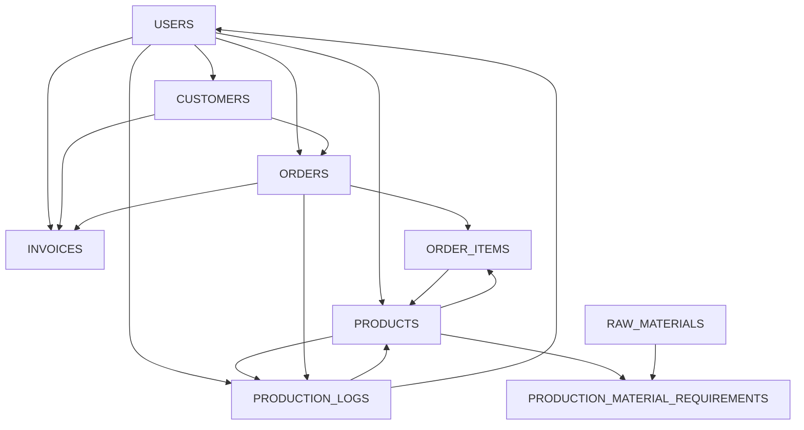

# Saft ERP - Simplified ER Diagram

## Core Business Flow



## Database Tables Summary

| Table | Purpose | Key Relationships |
|-------|---------|-------------------|
| **users** | User authentication & roles | Creates all other entities |
| **customers** | Customer management | Places orders, receives invoices |
| **products** | Product catalog & inventory | Ordered, produced, requires materials |
| **raw_materials** | Material inventory | Used in production requirements |
| **orders** | Order management | Contains items, tracked in production, billed |
| **order_items** | Order line items | Links orders to products |
| **production_logs** | Manufacturing tracking | Tracks order production |
| **production_material_requirements** | Bill of Materials | Links products to raw materials |
| **invoices** | Billing & payments | Bills orders, links to customers |

## Key Relationships

1. **One-to-Many**:
   - User → Customers, Products, Orders, Invoices, Production Logs
   - Customer → Orders, Invoices
   - Product → Order Items, Production Logs, Material Requirements
   - Order → Order Items, Production Logs, Invoices
   - Raw Material → Material Requirements

2. **Many-to-Many** (via junction table):
   - Products ↔ Raw Materials (via production_material_requirements)

## Business Process Flow

```
Customer Order → Order Items → Production Planning → 
Production Logs → Invoice Generation → Payment Tracking
```

## Data Integrity

- **Primary Keys**: UUID for all tables
- **Foreign Keys**: Maintain referential integrity
- **Unique Constraints**: Order numbers, invoice numbers, SKUs
- **Audit Trail**: created_at, updated_at timestamps
- **Status Tracking**: Order status, invoice status, customer status


