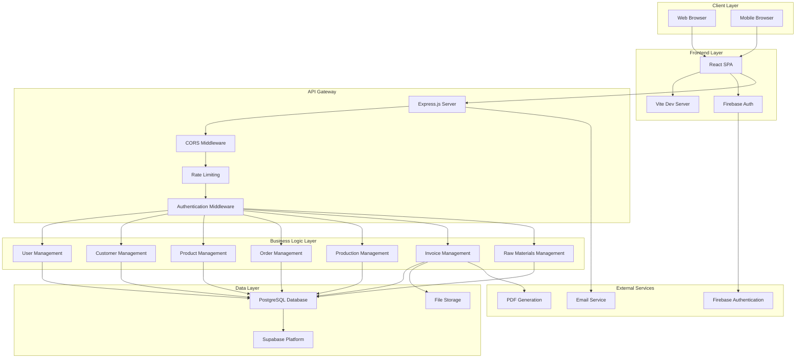
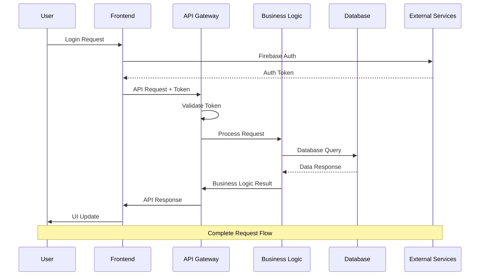
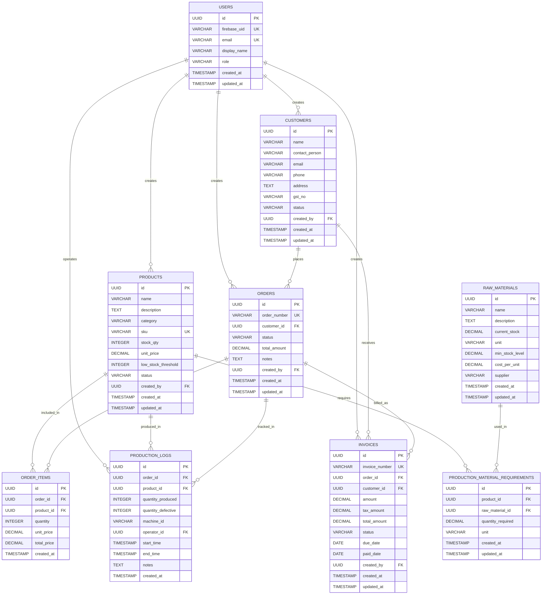
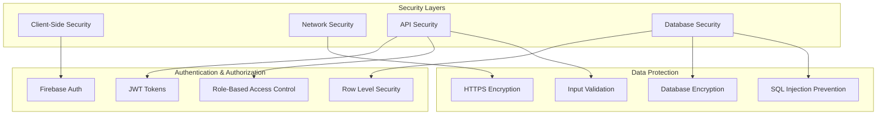
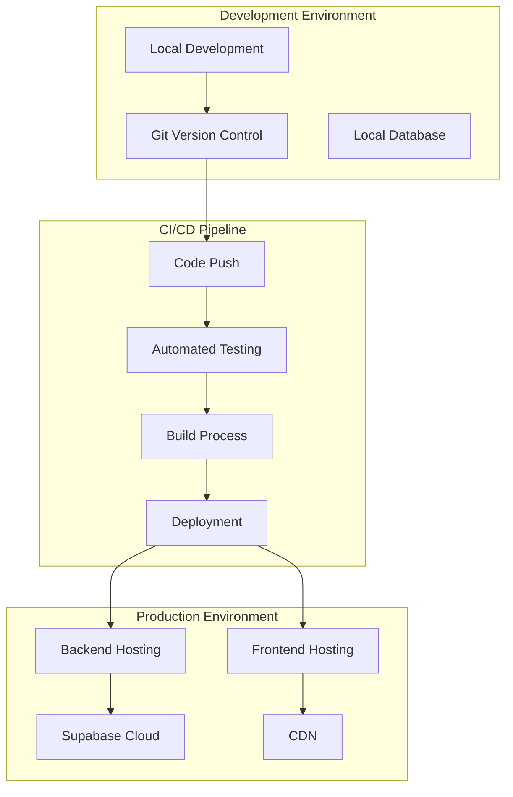
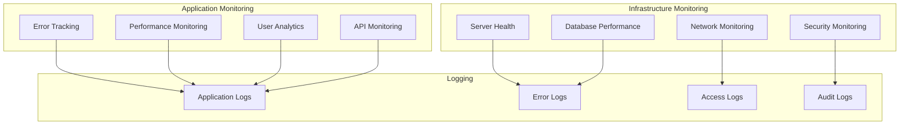
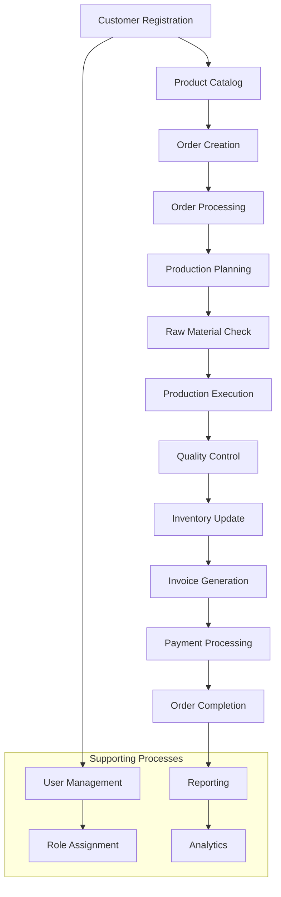

# Saft ERP - Complete Architecture Diagram

## System Overview

The Saft ERP system is a modern, full-stack enterprise resource planning application built with React, Node.js, and PostgreSQL, designed for manufacturing and inventory management.

## High-Level Architecture



## Detailed Component Architecture

```mermaid
graph TD
    subgraph "Frontend (React + Vite)"
        A1[App.jsx]
        A2[Auth Layout]
        A3[Protected Layout]
        A4[Pages]
        A5[Components]
        A6[Services]
        A7[Store (Redux)]
        
        A1 --> A2
        A1 --> A3
        A3 --> A4
        A3 --> A5
        A4 --> A6
        A5 --> A6
        A6 --> A7
    end
    
    subgraph "Backend (Node.js + Express)"
        B1[index.js - Main Server]
        B2[Routes]
        B3[Controllers]
        B4[Services]
        B5[Middleware]
        B6[Config]
        
        B1 --> B2
        B2 --> B3
        B3 --> B4
        B1 --> B5
        B5 --> B6
    end
    
    subgraph "Database Layer"
        C1[PostgreSQL]
        C2[Supabase]
        C3[Tables]
        C4[RLS Policies]
        C5[Indexes]
        
        C1 --> C2
        C2 --> C3
        C3 --> C4
        C3 --> C5
    end
    
    A6 --> B2
    B4 --> C1
```

## Data Flow Architecture



## Database Schema Architecture



## Technology Stack

### Frontend Technologies
- **React 18**: Modern UI library with hooks and functional components
- **Vite**: Fast build tool and development server
- **Tailwind CSS**: Utility-first CSS framework for styling
- **Redux Toolkit**: State management for complex application state
- **React Router**: Client-side routing
- **Axios**: HTTP client for API communication
- **Firebase Auth**: Authentication service

### Backend Technologies
- **Node.js**: JavaScript runtime environment
- **Express.js**: Web application framework
- **PostgreSQL**: Relational database management system
- **Supabase**: Backend-as-a-Service platform
- **Puppeteer**: PDF generation for invoices
- **Helmet**: Security middleware
- **CORS**: Cross-origin resource sharing
- **Rate Limiting**: API request throttling

### Database & Infrastructure
- **Supabase**: PostgreSQL hosting with real-time features
- **Row Level Security (RLS)**: Database-level security policies
- **Connection Pooling**: Efficient database connections
- **SSL/TLS**: Encrypted database connections

## Security Architecture



## Deployment Architecture



## API Architecture

```mermaid
graph LR
    subgraph "API Endpoints"
        A[/api/auth]
        B[/api/users]
        C[/api/customers]
        D[/api/products]
        E[/api/orders]
        F[/api/production]
        G[/api/raw-materials]
        H[/api/invoices]
        I[/api/reports]
        J[/api/stats]
    end
    
    subgraph "HTTP Methods"
        K[GET]
        L[POST]
        M[PUT]
        N[DELETE]
    end
    
    subgraph "Response Types"
        O[JSON Data]
        P[PDF Files]
        Q[Error Messages]
        R[Status Codes]
    end
    
    A --> K
    A --> L
    B --> K
    B --> M
    C --> K
    C --> L
    C --> M
    C --> N
    D --> K
    D --> L
    D --> M
    D --> N
    E --> K
    E --> L
    E --> M
    F --> K
    F --> L
    F --> M
    G --> K
    G --> L
    G --> M
    H --> K
    H --> L
    H --> M
    H --> P
    I --> K
    J --> K
    
    K --> O
    L --> O
    M --> O
    N --> O
    O --> R
    P --> R
    Q --> R
```

## Performance & Scalability

### Frontend Optimization
- **Code Splitting**: Lazy loading of components
- **Bundle Optimization**: Tree shaking and minification
- **Caching**: Browser caching and service workers
- **CDN**: Content delivery network for static assets

### Backend Optimization
- **Connection Pooling**: Efficient database connections
- **Caching**: Redis for frequently accessed data
- **Rate Limiting**: Prevent API abuse
- **Compression**: Gzip compression for responses

### Database Optimization
- **Indexing**: Optimized database indexes
- **Query Optimization**: Efficient SQL queries
- **Connection Pooling**: Supabase connection management
- **Read Replicas**: For read-heavy operations

## Monitoring & Logging



## Business Process Flow



This architecture provides a robust, scalable, and maintainable ERP system that can handle the complex requirements of manufacturing and inventory management while ensuring security, performance, and user experience.
